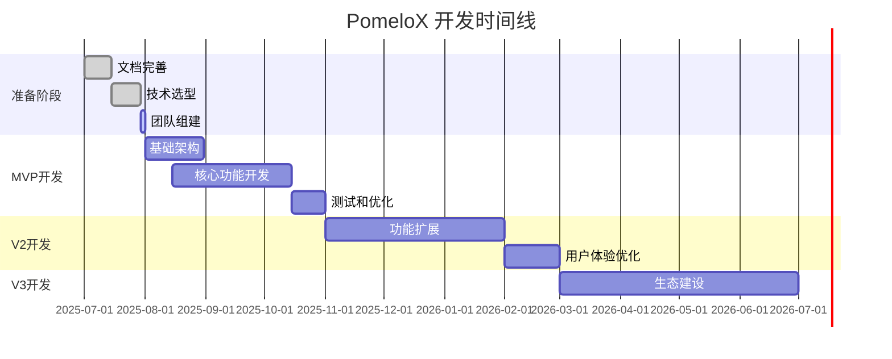

# PomeloX 项目文档概览

## 📋 项目简介
PomeloX 是一个专为赴美中国留学生及其家庭设计的一站式服务平台，旨在解决留学生在学习和生活中遇到的实际困难，从行前准备到在地生活，从学业支持到职业发展，提供全面、贴心、可信赖的服务与支持。

## 📚 文档结构

### 1. [MRD.md](./MRD.md) - 市场需求文档
**目标受众:** 产品经理、运营团队、投资人  
**主要内容:**
- 市场分析和用户画像
- 竞品分析和差异化策略
- 商业模式和收入预测
- 市场风险评估

**何时使用:** 项目立项、融资路演、市场策略制定

### 2. [PRD.md](./PRD.md) - 产品需求文档
**目标受众:** 产品团队、设计师、开发工程师  
**主要内容:**
- 详细的功能需求和用户故事
- 版本规划和开发里程碑
- 非功能性需求（性能、安全、可用性）
- 技术栈选择和架构决策

**何时使用:** 功能设计、开发排期、测试验收

### 3. [API_DOC.md](./API_DOC.md) - 接口文档
**目标受众:** 前端工程师、后端工程师、测试工程师  
**主要内容:**
- RESTful API 接口定义
- 请求/响应格式规范
- 错误码和异常处理
- 认证和权限控制

**何时使用:** 前后端并行开发、接口联调、API测试

### 4. [DB_SCHEMA.md](./DB_SCHEMA.md) - 数据库设计文档

### 5. [I18N_IMPLEMENTATION.md](./I18N_IMPLEMENTATION.md) - 国际化实施方案

### 6. [NEWONE.MD](./NEWONE.MD) - 最新产品思路
**目标受众:** 全体团队成员  
**主要内容:**
- 完整的8大功能模块设计
- 详细的用户画像和痛点分析
- 清晰的版本规划和时间节点
- 用户粘性机制和商业模式

**何时使用:** 产品规划、功能开发、团队对齐时的参考基准
**目标受众:** 全体开发团队、产品团队  
**主要内容:**
- 多语言支持技术架构
- 前端和后端国际化实现
- AI问答多语言支持
- 翻译工作流程和质量保证

**何时使用:** 功能开发时的国际化考虑、翻译内容管理
**目标受众:** 后端工程师、数据库管理员、运维工程师  
**主要内容:**
- 数据表结构和关系设计
- 索引优化策略
- 数据库配置和备份方案
- 性能监控指标

**何时使用:** 数据库搭建、数据迁移、性能优化

## 🚀 快速开始

### 对于产品团队
1. 先阅读 `MRD.md` 了解市场背景和商业逻辑
2. 详细研读 `PRD.md` 掌握功能需求和开发计划
3. 根据里程碑制定具体的产品迭代计划

### 对于开发团队
1. 通过 `PRD.md` 理解产品功能和技术要求
2. 参考 `API_DOC.md` 进行前后端接口设计
3. 基于 `DB_SCHEMA.md` 搭建数据库环境
4. 建议前后端工程师同时阅读 API 文档，确保接口契约一致

### 对于运营团队
1. 重点关注 `MRD.md` 中的用户画像和市场分析
2. 了解 `PRD.md` 中的功能规划，制定运营策略
3. 关注各版本的发布节点，配合产品推广

## 📈 项目时间线

## 🔄 文档维护

### 更新频率
- **MRD.md:** 季度回顾更新，市场变化时及时调整
- **PRD.md:** 每个版本迭代前更新，功能变更时实时修改
- **API_DOC.md:** 接口变更时立即更新，保持与代码同步
- **DB_SCHEMA.md:** 数据库结构变更时更新，包含迁移脚本

### 版本控制
所有文档变更都应该：
1. 通过 Git 进行版本控制
2. 重大变更需要团队 Review
3. 保留变更历史和原因说明

## 🤝 贡献指南

### 文档修改流程
1. 创建分支进行修改
2. 提交 Pull Request
3. 相关负责人 Review
4. 合并到主分支

### 文档规范
- 使用中文编写，专业术语可保留英文
- 保持格式统一，使用 Markdown 语法
- 图表使用 Mermaid 语法
- 代码示例使用相应语言的语法高亮

## 📞 联系方式

如有任何问题或建议，请联系：
- 产品相关：产品负责人
- 技术相关：技术负责人  
- 文档维护：项目经理

---
*最后更新时间：2025年7月* 